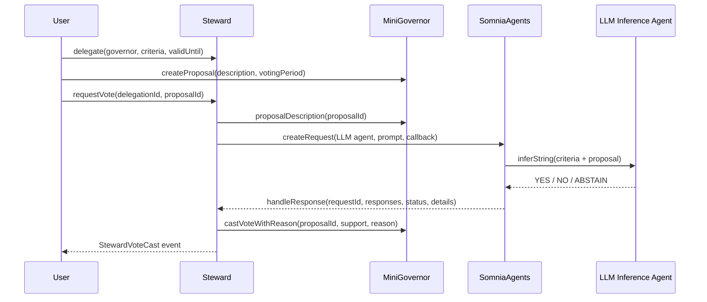

# Steward Architecture

Steward is intentionally small: one delegate contract, one minimal governor, one Somnia LLM agent path, and one proof page.

For trust boundaries, failure modes, and production limitations, see [`THREAT_MODEL.md`](./THREAT_MODEL.md).

## Flow

## Contracts

| Contract | Role |
| --- | --- |
| `Steward.sol` | Stores delegations, invokes SomniaAgents, validates callbacks, parses the agent vote, and casts into the governor. |
| `MiniGovernor.sol` | Minimal proposal/vote target used to prove the governance loop without Snapshot/Tally integration risk. |
| `HelloSomniaCallback.sol` | Small callback proof used to validate the raw Somnia agent request/callback path before the full Steward loop. |

## Why The Agent Is Load-Bearing

`requestVote` does not take a vote parameter from the frontend. It builds a prompt from stored criteria plus proposal text and sends that to SomniaAgents. Steward only mutates governance state after `handleResponse` is called by the SomniaAgents requester contract.

That means the Somnia agent path sits between proposal detection and final governance state:

1. No agent request, no vote request.
2. No successful callback, no `StewardVoteCast`.
3. No parsed `YES`, `NO`, or `ABSTAIN`, no governor vote.

## Callback Safety

Steward guards the callback path with:

- `msg.sender == address(SOMNIA_AGENTS)`.
- Request id must exist.
- Request id must still be pending.
- Optional `details.id` must match the request id.
- Agent output must start with one allowed vote value.
- Governor rejection moves the request to failed instead of pretending the vote cast.

## Scope Boundaries

This is a hackathon MVP, not a production DAO delegate marketplace.

In scope:

- Live Somnia testnet contracts.
- Live LLM Inference agent requests.
- Async callback into Steward.
- YES, NO, and ABSTAIN examples.
- Public verifier scripts and proof page.

Out of scope:

- Real DAO integrations.
- Snapshot/Tally adapters.
- Delegate marketplaces.
- Reputation or slashing.
- Cross-chain governance.
