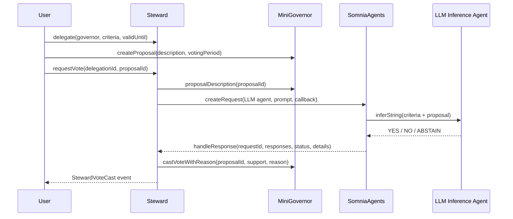
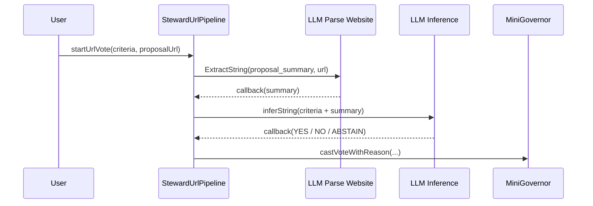
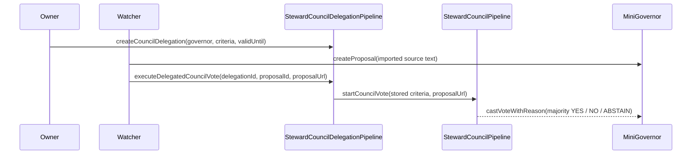

# Steward Architecture

Steward is intentionally small: one delegate contract, one minimal governor, one base Somnia LLM path, and additive URL/council pipelines for the stronger live proof.

For trust boundaries, failure modes, and production limitations, see [`THREAT_MODEL.md`](./THREAT_MODEL.md).

## Flow

## Contracts

| Contract | Role |
| --- | --- |
| `Steward.sol` | Stores delegations, invokes SomniaAgents, validates callbacks, parses the agent vote, and casts into the governor. |
| `MiniGovernor.sol` | Minimal proposal/vote target used to prove the governance loop without Snapshot/Tally integration risk. |
| `HelloSomniaCallback.sol` | Small callback proof used to validate the raw Somnia agent request/callback path before the full Steward loop. |

## Why The Agent Is Load-Bearing

`requestVote` does not take a vote parameter from the frontend. It builds a prompt from stored criteria plus proposal text and sends that to SomniaAgents. Steward only mutates governance state after `handleResponse` is called by the SomniaAgents requester contract.

That means the Somnia agent path sits between proposal detection and final governance state:

1. No agent request, no vote request.
2. No successful callback, no `StewardVoteCast`.
3. No parsed `YES`, `NO`, or `ABSTAIN`, no governor vote.

## URL Pipeline

`StewardUrlPipeline` is the next additive architecture slice. It keeps the same callback discipline, but splits the agent work into two Somnia requests:

This single-reviewer URL pipeline is implemented as a separate contract so the deployed base `Steward` proof remains untouched while URL-ingestion paths are tested independently.

## Council Pipeline

`StewardCouncilPipeline` is the live judge-facing path. It composes one Parse Website request with three LLM Inference reviewers:

1. Parse Website extracts decision-critical facts from a public proposal URL.
2. Budget, risk, and participation reviewers independently return `YES`, `NO`, or `ABSTAIN`.
3. The contract records each reviewer decision and casts the majority outcome into `MiniGovernor`.

The execution model is permissionless: anyone can pay to start a council job, but they cannot change the fixed agent ids, authorized callback sender, target governor passed into the job, or final majority rule. Unused reviewer deposits are credited to `claimRefund` rather than pushed during callbacks.

## Callback Safety

Steward guards the callback path with:

- `msg.sender == address(SOMNIA_AGENTS)`.
- Request id must exist.
- Request id must still be pending.
- Optional `details.id` must match the request id.
- Agent output must start with one allowed vote value.
- Governor rejection moves the request to failed instead of pretending the vote cast.

## Delegated Council Wrapper

`StewardCouncilDelegationPipeline` is the current V2 autonomy wrapper. It stores a council mandate once, then lets a watcher or third-party executor pay for proposal evaluation without resupplying the criteria.

This wrapper deliberately keeps execution permissionless. The owner controls the stored mandate, governor, expiry, and revocation. The executor supplies the proposal id and proposal URL for a specific run, which is why production deployments should add authenticated proposal registries or DAO-native adapters before using this against real governance.

## Scope Boundaries

This is a hackathon MVP, not a production DAO delegate marketplace.

In scope:

- Live Somnia testnet contracts.
- Stored delegated council execution.
- Live Parse Website and LLM Inference agent requests.
- Async callbacks into Steward and the council pipeline.
- YES, NO, and ABSTAIN examples through both the delegated council path and the direct lower-level path.
- Public verifier scripts and proof pages.

Out of scope:

- Real DAO integrations.
- Snapshot/Tally adapters.
- Delegate marketplaces.
- Reputation or slashing.
- Cross-chain governance.
